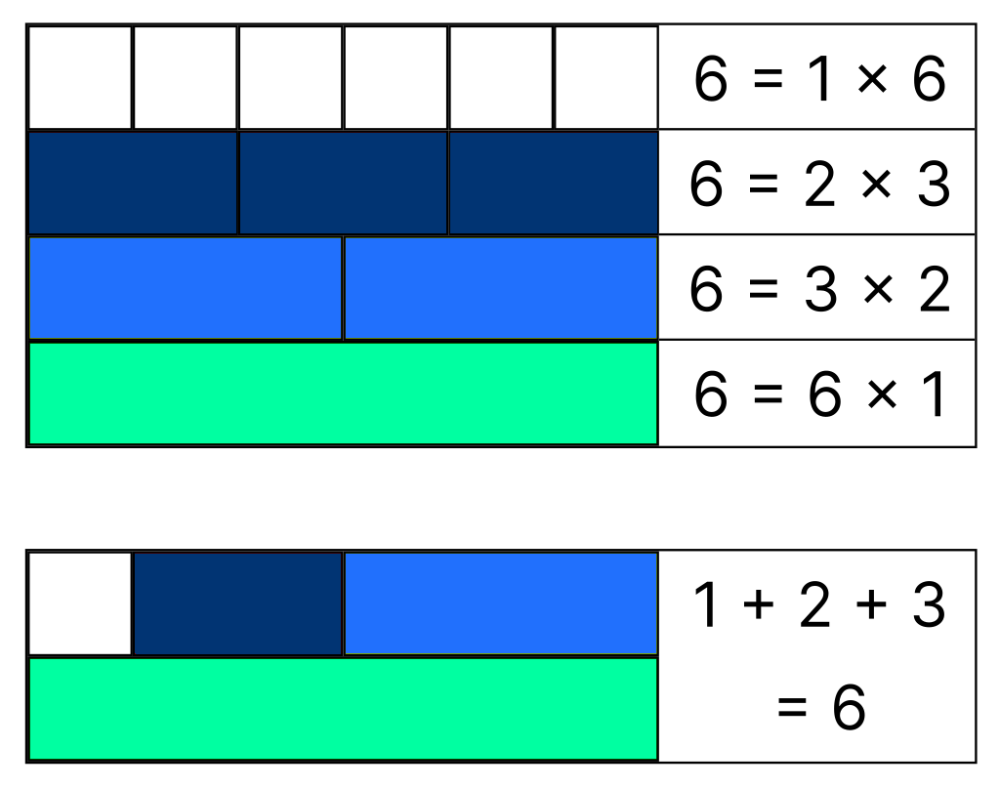

Статья взята с https://habr.com/ru/companies/bercut/articles/778056/

# Совершенные числа. Удивительная история поисков сверкающих звёзд в бесконечном числовом мире

### История математики состоит из постоянного поиска закономерностей в волшебном и необозримом океане чисел. 
### Учёные-романтики уже много веков бороздят этот океан в стремлении найти скрытые до поры до времени течения и водовороты, 
### чтобы потом использовать их на благо человечества.
### Математика не только универсальная, но и удивительно красивая наука. В ней древние многовековые знания органично 
### соединяются с современными теориями и вычислениями. Многие математические задачи, которые возникли ещё до нашей эры, 
### не имеют решения до сих пор. Эти задачи будоражат умы учёных на протяжении столетий. Невозможно предсказать, что может 
### скрывать в себе пока не найденный ответ, какие смежные проблемы он поможет решить. Возможно, этот ответ станет ключом 
### к новому сокровенному знанию, которое перевернёт наш мир и породит новую технологическую революцию.
### В одной из таких загадок, как в зеркале, отражается вся удивительная история математики. Эта задача связана с рядом 
### чисел, которые ещё в глубокой древности называли «совершенными» (др.-греч. ἀριθμὸς τέλειος). Последующие поколения 
### математиков добавляли в копилку знаний человечества новые числа этого ряда. Процесс ещё не окончен, поиски продолжаются. 
### Кроме того, с совершенными числами связано много тайн и не разрешённых до сих пор загадок. Что же в них такого особенного?

# Сверкающие звёзды в огромной бездне чисел

### Для начала немного теории. Натуральное число считается совершенным, если оно равно сумме своих делителей, 
### отличных от самого числа. Самое маленькое совершенное число — 6 = 1 + 2 + 3. 
### Следующее совершенное число — 28 = 1 + 2 + 4 + 7 + 14. Дальше идут числа 496 и 8128.

### Почему же эти числа называют «совершенными»? Ведь существует ещё множество других интересных чисел с не менее 
### выдающимися свойствами. Но для древнегреческих философов-пифагорейцев эти числа были самыми красивыми, самыми 
### особенными из всех. Для них они были подобны сверкающим звёздам в бесконечном числовом мире. И действительно, 
### совершенных чисел совсем немного — это штучное явление. А всё то, что красиво и редко встречается, привлекает особое внимание.
### Например, древнегреческий философ и математик Никомах Герасский писал: «Совершенные числа красивы. Но известно, 
### что красивые вещи редки и немногочисленны, безобразные же встречаются в изобилии. Избыточными и недостаточными 
### являются почти все числа, в то время как совершенных чисел немного».
### Кроме того, для многих древних народов, культур и религий числа «6» и «28» имели глубокий символический смысл. 
### В Древней Греции шестое место на званых пирах считалось самым почётным, его занимал самый уважаемый гость. 
### В Библии написано, что мир был сотворён за 6 дней. Много внимания этому числу уделил и Платон в своих «Диалогах».
### Число «28» — тоже не такое простое, как может показаться. Например, неопифагорейская академия наук состояла из 28 членов. 
### До недавнего времени по обычаю столько же членов должны были входить в различные учёные общества. Да и лунный месяц составляет около 28 дней.

# Все дороги ведут к простым числам

### До Евклида древние математики не знали других совершенных чисел, кроме 6 и 28. Но великий основатель геометрии доказал, 
### что совершенное число можно представить в виде произведения множителей 2p−1 и 2p−1, причём второй множитель должен быть 
### простым числом. С этим последним условием возникло больше всего сложностей. Во многом именно из-за него история 
### совершенных чисел не завершена до сих пор.
### Для p = 2 получаем первое совершенное число: 22−1 × (22−1) = 6. Второе совершенное число 28 соответствует p = 3. 
### Благодаря своей формуле, Евклид нашёл ещё два совершенных числа: 496 — для p = 5 и 8128 для p = 7.
### После этого дело застопорилось на много веков. Долгое время никому не удавалось вычислить пятое совершенное число. 
### Никто даже не мог сказать, существует ли оно вообще. А ведь в те времена люди верили, что тому, кто найдёт следующее 
### совершенное число, уготовано вечное блаженство. Несмотря на столь заманчивое обещание, никто так и не смог это сделать 
### за полторы тысячи лет.
### Это и не удивительно. Ведь пятое совершенное число намного больше четвёртого — 33 550 336. Его отыскали только в XV веке. 
### Сначала считалось, что это сделал голландский математик Худалрик Региус в 1536 году. Но потом историки обнаружили 
### неопубликованную рукопись немецкого математика, астронома и астролога Региомонтана, датированную 1461 годом. 
### В ней содержалось пятое совершенное число. Оно тоже подчинялось формуле Евклида для p = 13.
### После этого стало понятно, что каждое последующее совершенное число гораздо больше предыдущего. Поэтому поиск 
### очередного совершенного числа для каждого поколения математиков превращался в нетривиальную задачу. Рене Декарт 
### по этому поводу метко заметил, что «совершенные числа, как и совершенные люди, встречаются редко».

# Таинственное прозрение европейских математиков

### Ещё через 200 лет в раскрытии тайны совершенных чисел поучаствовал французский математик и музыкант Марен Мерсенн. 
### В XVII веке он был, по существу, координатором научной жизни Европы, вёл активную переписку практически со всеми 
### видными учёными того времени: Галилеем, Паскалем, Торричелли и многими другими. Ещё он был другом Декарта и Ферма, 
### а также являлся одним из основателей Парижской академии наук.
### Неудивительно, что Мерсенн заинтересовался совершенными числами, которые будоражили умы математиков уже не одно столетие. 
### В 1644 году он опубликовал сочинение "Cogitata physico-mathematica", в котором утверждал, что следующие шесть 
### совершенных чисел должны соответствовать в формуле Евклида с такими значениями p: 17, 19, 31, 67, 127 и 257.
### В то время проверить утверждение Мерсенна не представлялось возможным. Вычислить числа 2p−1 с указанными значениями p 
### было не так сложно, но требовалось ещё доказать, что они являются простыми. И как раз эта задача для математики того 
### времени была неразрешима.
### Позднее в записках итальянского профессора математики Катальди были обнаружены значения шестого и седьмого совершенных 
### чисел: 8 589 869 056 и 137 438 691 328. Он обнаружил их в 1603 году. Эти числа как раз соответствовали предсказанным 
### Мерсенном значениям p — 17 и 19. Но итальянец сделал это открытие за несколько десятков лет до француза. Однако и он 
### упёрся в проблему простых чисел и не смог однозначно доказать свою правоту.
### Позднее выяснилось, что Катальди действительно нашёл следующие два совершенных числа. Кстати, попутно он опроверг 
### древнюю гипотезу о том, что все совершенные числа попеременно заканчиваются то на 6, то на 8.
### Для историков науки до сих пор остаётся тайной, как именно Мерсенн и Катальди смогли открыть шестое и седьмое 
### совершенные числа при тогдашнем уровне развития математики. Хотя сегодня мы знаем, что Мерсенн всё же допустил ошибку. 
### Он правильно предсказал значения p = 31 и p = 127, но ошибся в значениях p = 67 и p = 257.
### После этого в непростой истории совершенных чисел появилась ещё одна важная теорема. Леонард Эйлер доказал, что 
### формула Евклида описывает все чётные совершенные числа. Про то, какими должны быть нечётные совершенные числа, и 
### существуют ли они вообще, неизвестно до сих пор. Эйлер также доказал, что первые три значения p, которые предсказал 
### Марен Мерсенн, действительно дают простые числа. Так семейство совершенных чисел пополнилось восьмым членом: 
### 2 305 843 008 139 952 128 для p = 31.

# Последний вычислительный подвиг и эпоха ЭВМ

### Дальше процесс поиска совершенных чисел опять застопорился. Ведь учёным для этого требовалось доказывать простоту чисел, 
### причём это приходилось делать путём обычных «ручных» вычислений. Мерсенн сам заявлял, что целой вечности не хватит для 
### проверки простоты числа, которое имеет от 15 до 20 десятичных знаков.
### Девятое совершенное число было найдено только в 1883 году. Честь этого открытия принадлежит пермскому сельскому 
### священнику Ивану Михеевичу Первушину. Ему удалось вычислить самое большое для того времени простое число 
### вида 2p−1 для p = 61. Оно содержало 19 цифр: 2 305 843 009 213 693 951. Ему соответствовало совершенное число 
### 2 658 455 991 569 831 744 654 692 615 953 842 176.
### Больше таких вычислительных подвигов никто не совершал и следующие совершенные числа математики получили только 
### в XX веке — с помощью появившихся счётных устройств. Десятое совершенное число (54 цифры) открыли в 1911 году, 
### одиннадцатое (65 цифр) и двенадцатое (77 цифр) — в 1914 году.
### Для поиска последующих совершенных чисел учёные уже использовали ЭВМ. В 1952 году американский математик Робинсон 
### из Калифорнийского университета написал программу, которая сначала вычисляла значение очередного числа 2p−1, 
### а затем проверяла, является ли оно простым. С помощью этой программы 30 января 1952 года список совершенных чисел 
### пополнился тринадцатым и четырнадцатым пунктами.